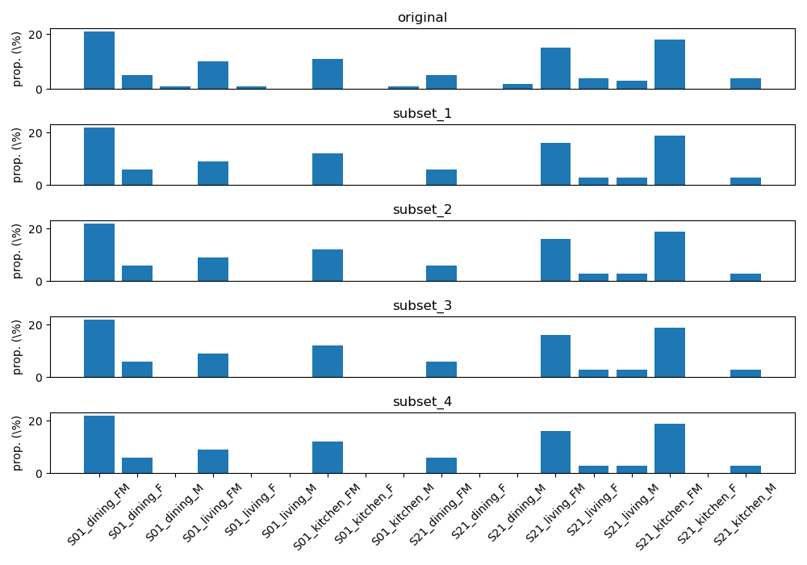

# Configuration for the listening test

## Preliminaries 

Download and unzip [this file](https://drive.google.com/file/d/1v3bBiDm8FR7WB7B9ejX579txXfz2u5wv/view?usp=sharing) that contains a `data` folder with the following structure:
```
├── C0
├── C1
├── C2
├── C3
└── C4
└── ref
```

Each directory `Cx` corresponds to an experimental condition (`C0` corresponds to the unprocessed condition and `C1` to `C4` correspond to the output of four systems). For the moment, these conditions correspond to the baseline systems, and C3 and C4 are identical.

Each experimental condition contains a list of stimuli (with the same `wav` file names). The directory `ref` contains the reference conditions for the anchoring/training phase of the listening test. See Table 1 of [this paper](https://arxiv.org/pdf/2010.13200.pdf) for a description of the reference conditions.

## Experiment design

The configuration of the listening test follows the protocol described in [this Google doc](https://docs.google.com/document/d/1mIRKcIShbw0jMrEd8qqZ5ocXI77wIk8jxgVrCD6P6gk/edit?usp=sharing). For an overall visualization of what should be the output of the listening test, you can also have a look at [this Google spreadsheet](https://docs.google.com/spreadsheets/d/1juJbTaKh-vQbdEh0b_XAWzPmUfX3iVNn-_1vZmJOmz4/edit?usp=sharing), where the green cells are the ones that should be filled by the results of the listening experiment.


### Material

We have a total of N = 239 audio samples (noisy speech signals) in the evaluation dataset that is going to be used for the listening test. These audio samples were extracted from the CHiME-5 eval set by looking for segments of 4 to 5 seconds that contain at least 3 seconds of speech and with 0.25 second without speech at the beginning and at the end of the segment. Additional constraints were taken into account to ensure an approximately balanced dataset in terms of recording session (S01 or S21), recording location (kitchen, dining room or living room), and speaker gender (FM, F, or M), leading to the following:
- session: 
    - 'S01': 119 samples
    - 'S21': 120 samples
- location: 
    - 'dining': 79 samples
    - 'living': 79 samples
    - 'kitchen': 81 samples
- gender: 
    - 'FM': 183 samples
    - 'F': 29 samples
    - 'M': 27 samples

where FM indicates segments that contain both female and male speakers, and M (resp. F) indicates segments that contain only male (resp. female) speakers. 

### Partitioning the data in equivalent subsets (`create_subsets_listening_test.py`)

Each subject will undergo a listening test including C experimental conditions (C-1 submissions + the unprocessed noisy speech).

The ideal experiment would test all listeners on all experimental conditions, using the entire corpus of speech materials for each experimental condition. However, in practice, the time limit imposed for each listener test restricts the number of trials per listener. Consequently, we have to separate listeners into groups (or panels) so that listeners as a whole rate the entire corpus of speech materials, but each group rates only a subset of that corpus. Furthermore, each group of listeners should hear an equivalent, though not identical, subset of those materials. 

We target a total number of 32 subjects, separated in 4 panels of 8 listeners. Each panel will be associated with a subset of M audio samples, taken from the pool of N = 239 audio samples mentioned above. The number of audio samples M should be adjusted depending on the number C of experimental conditions and the time limit for each listener test.

We designed the data splitting process to ensure equivalent subsets in terms of recording session (S01 or S21), recording location (kitchen, dining room or living room), and speaker gender (FM, F, or M). 

We target C = 5 experimental conditions (4 submissions + the unprocessed noisy speech). We made the choice that each listener will rate all C experimental conditions (i.e., denoising algorithms + unprocessed noisy speech) for each of the M audio examples in his/here subset. This results in a total of M x C different audio samples that a listener will have to listen to (plus the reference conditions during the anchoring phase at the beginning of the test). Each audio sample will be rated according to 3 different rating scales (SIG, BAK, MOS). We should set the number of audio samples per subset to M = 32 in order to limit the duration of each listener test (see [this file](https://docs.google.com/spreadsheets/d/14monM79OnHGqvkA2yVHI1qAQLV9O2fDGG1m9KkoTD_E/edit?usp=sharing) for more information). Using `create_subsets_listening_test.py`, we created 4 subsets of M = 32 audio samples and obtain the following splitting:

```
original - 239 samples
...{'S01': 119, 'S21': 120}
...{'dining': 79, 'living': 79, 'kitchen': 81}
...{'FM': 183, 'F': 29, 'M': 27}
subset_1 - 32 samples
...{'S01': 15, 'S21': 17}
...{'dining': 11, 'living': 11, 'kitchen': 10}
...{'FM': 24, 'F': 4, 'M': 4}
subset_2 - 32 samples
...{'S01': 15, 'S21': 17}
...{'dining': 11, 'living': 11, 'kitchen': 10}
...{'FM': 24, 'F': 4, 'M': 4}
subset_3 - 32 samples
...{'S01': 15, 'S21': 17}
...{'dining': 11, 'living': 11, 'kitchen': 10}
...{'FM': 24, 'F': 4, 'M': 4}
subset_4 - 32 samples
...{'S01': 15, 'S21': 17}
...{'dining': 11, 'living': 11, 'kitchen': 10}
...{'FM': 24, 'F': 4, 'M': 4}

```

See also the following figure that shows the distribution of the recording conditions in the original dataset (top plot) and in the four subsets (four bottom plots).



The N audio samples of the original dataset are described in `samples_all.csv`. The audio samples in each subset are described in `samples_subset_[1,2,3,4].csv`.

We will have 8 votes per (stimulus, condition) pair, for each rating scale. We have a total of 32 samples x 4 subsets = 128 samples. This leads to 8 votes x 128 samples = 1024 votes for each condition. 


## Configuration file for each subject (`generate_config_files.py`)

The folder `config_files` contains the configuration files for each participant to the listening test (subject), in csv or json formats (in the corresponding subfolders). These files were generated by the script `generate_config_files.py`. You can open any of these configuration files and you will see that each row in a csv file or each entry of a json file corresponds to an audio sample that should be played in a dedicated page of the software interface, and with a dedicated instruction. 

The M x C audio samples for a each subject were randomized without any constraint. The list of randomized samples was partitioned in 4 listening sessions.  For half of the subjects, the rating scale order was chosen to be SIG–BAK–OVRL for listening sessions 1 and 2, and BAK–SIG–OVRL for listening sessions 3 and 4. For the other half of the subjects, the sessions and scale order was counter-balanced.

The randomization has already been done when creating the configuration files, these are thus read linearly by the software.

Each sample in a config file is therefore characterized by the following pieces of information:
- `subset` (an integer between 1 and 4): a subset index, as the entire P.835 test is splitted into 4 subsets (or "sub-tests").
- `session` (an integer between 0 and 4): a listening session index. Session index 0 corresponds to the anchoring phase of the test (using the reference conditions). Session indices 1 to 5 correspond to the four listening sessions (using the experimental conditions). Participants should take a short rest period between each session. A dedicated page in the software will tell the participants to have a break.
- `file` (a string): path to the wav file.
- `scale` (a string which is `SIG`, `BAK` or `OVRL`): the rating scale for this sample, which also indicates which instruction to display.


